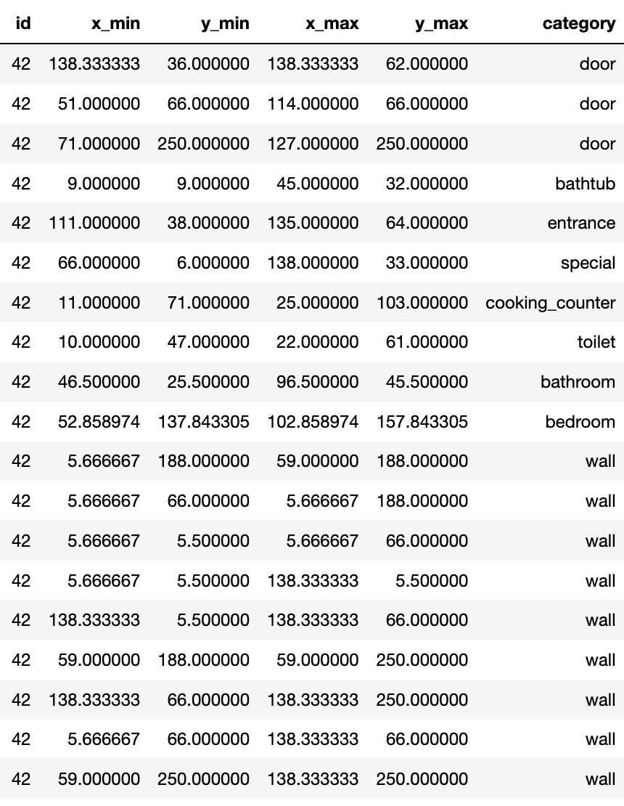
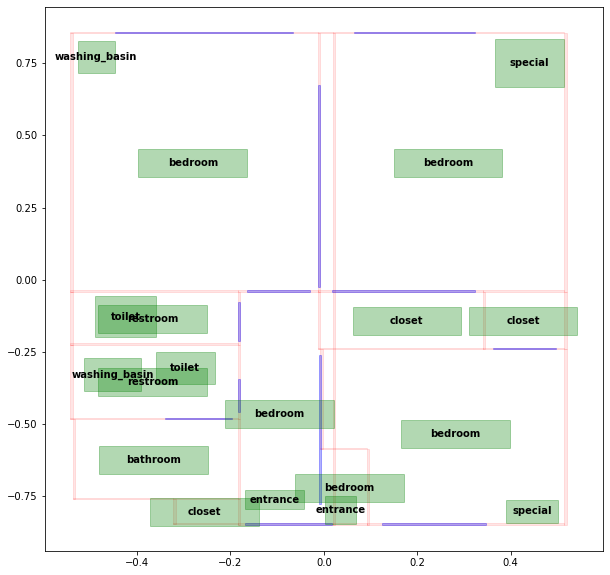
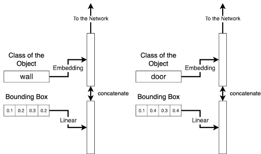
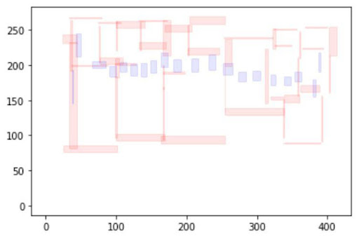
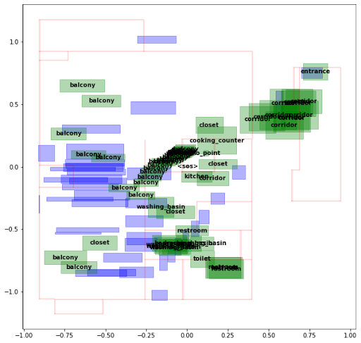
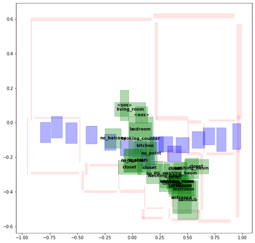

# Generative 'Tinder' for Interior Design 

## Idea Description 
The idea is to predict interior elements and generate their location for a given flat plan depending on the user's preferences.
Each item that can be predicted is taken from a catalogue of available items. A catalogue of available items is formed from the catalogues of the specialized furniture companies (e.g. IKEA, Mömax, Otto, etc.).

Relaxed problem setting:
Based on a given layout of the flat, predict which objects (e.g. bed, table, kitchen) can be found in the apartment and where they will be located.
## Data
The data was taken from [https://github.com/art-programmer/FloorplanTransformation](https://github.com/karpathy/minGPT) .

* Each object on the plan is represented by a category and a bounding box
* We normalise the data
* We sort objects and their locations, i.e. walls first, then doors, then kitchen, etc. The objects are sorted by their locations in ascending order by x\_min, y\_min, x\_max, y\_max.

In total, we have access to around 100,000 floorplans.
#### Example of raw data

#### Visualization

## Data :: General technique for obtaining a hidden representation

## Methods :: GPT-like
Given <sos> token, the model must predict the location **and** classes of walls and doors

> Based on [this code](https://github.com/karpathy/minGPT)

## Methods :: seq2seq-like
We feed embedding of <wall> class and their locations (bounding boxes) to the encoder and ask the decoder to predict the locations **and** classes of the remaining objects.

> Based on [this code](https://buomsoo-kim.github.io/attention/2020/04/21/Attention-mechanism-19.md/)

## Methods :: BERT-like
Here we assume that the problem of the recommendation system (predicting which objects will be in the apartment) has already been solved by another model or an oracle.

We feed embeddings of **all** classes and locations of walls (other locations are random) to BERT and ask model to predict **only** the locations of the objects.

## Results
Not inspiring yet. 

GPT: 

seq2seq: 

BERT: 

